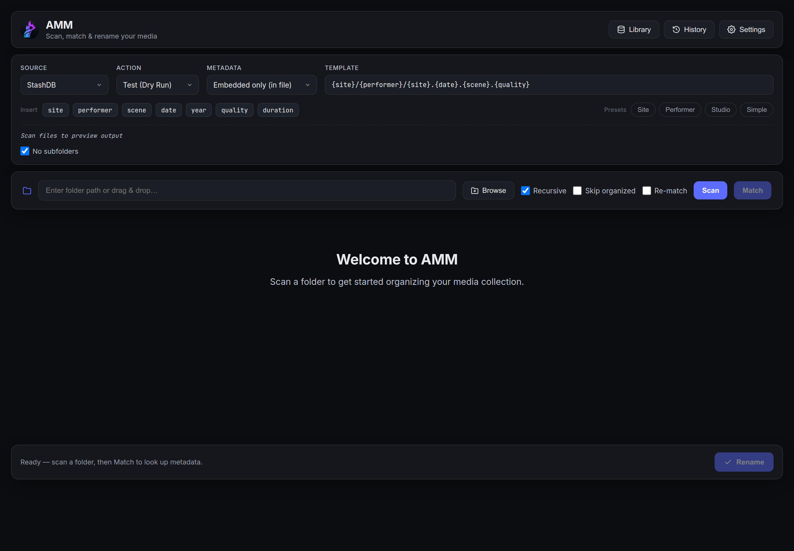
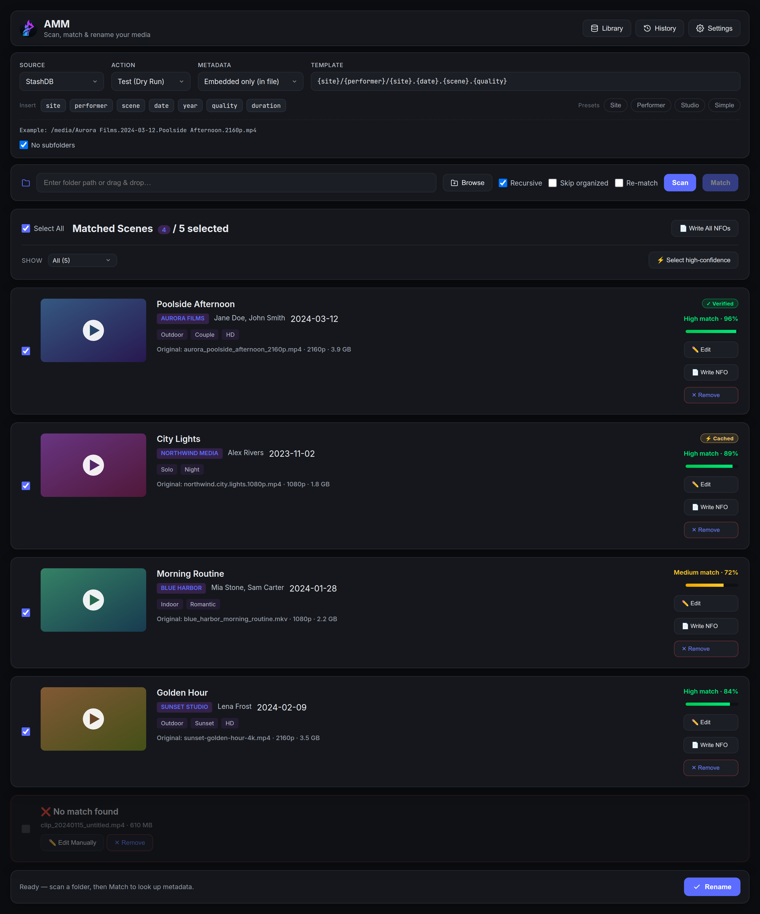
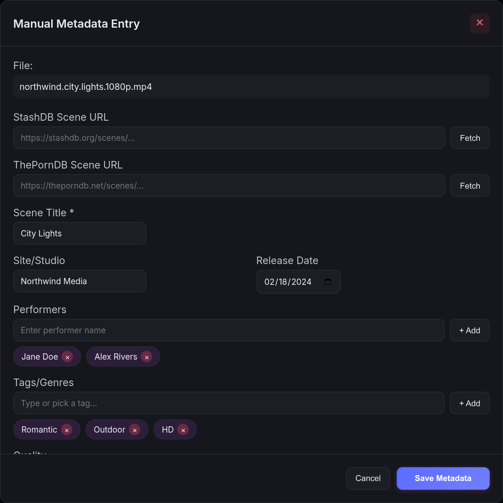
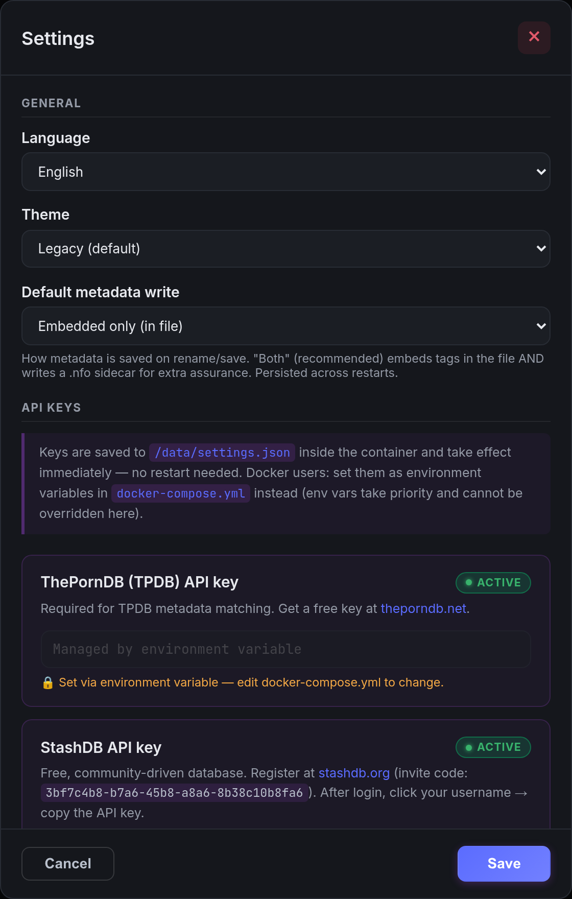

# Adult Media Manager

**Self-hosted media organizer for adult collections — powered by ThePornDB & StashDB**

Automatically identifies, tags, and renames adult scene files using metadata from two independent databases. Scan a folder, match scenes with confidence scores and thumbnails, pick a naming template, and let the app do the rest — safely, with full undo support.

---

## Age Restriction

**THIS SOFTWARE IS INTENDED FOR ADULTS ONLY (18+)**

By using this software you confirm you are of legal age to access adult content in your jurisdiction. The authors accept no responsibility for misuse or violation of local laws.

---

## Screenshots

Clean, flat interface with a live naming-template preview and three built-in themes (Legacy, Dark, Light) — shown here in **Dark**.

<p align="center">
  
</p>

**Confidence-scored matching** — every file gets a High / Medium band, a provenance badge (Verified / Cached), a thumbnail, tags and one-click actions:

<p align="center">
  
</p>

| Manual metadata entry | Settings |
|:---------------------:|:--------:|
| [](docs/screenshots/amm-manual-edit.png) | [](docs/screenshots/amm-settings.png) |

> _Screenshots use placeholder data — the studios, performers and thumbnails shown are entirely fictional._

---

## Features at a Glance

| | |
|---|---|
| Smart detection | 7 filename pattern formats — parses site, date, performers, quality automatically |
| Folder-context detection | A generically-named file inside `Vixen/` or `Site - Title (Date)/` folders inherits the site/title from the folder name (marked 📁) |
| Two databases | [ThePornDB](https://theporndb.net/) and [StashDB](https://stashdb.org/) — use one or both |
| Paste a scene link | Paste a `stashdb.org/scenes/…` or `theporndb.net/scenes/…` URL in manual edit and **Fetch** full metadata in one click |
| Fingerprint matching | OSHash + stash-compatible perceptual-hash (pHash) lookups for exact, "Verified" matches — batched (one query per 40 files) and reusing scan-computed hashes, so fingerprint matching is instant |
| Self-learning aliases | Confirmed matches teach performer aliases (from StashDB per-scene credits) and site abbreviations ("MFHM" → "My Friends Hot Mom") — matching gets smarter with use |
| Wrong match? Pick another | Every match keeps its runner-up candidates one click away — swap without a manual-edit round trip |
| Live streaming scan & match | Results appear as they're found; **Stop** a scan or **Cancel** a match at any time and keep the partial results |
| Match cache | Confirmed matches are remembered (by content hash) — rescans are instant and skip the API; **Re-match** forces a refresh |
| Incremental rescan & duplicates | A catalog tracks organised files so re-scans skip them; same-content duplicates are detected |
| Confidence bands & review queue | High / Medium / Low colour bands + filters to batch-confirm strong matches and focus on the ambiguous middle |
| Naming templates | 6 built-in + fully custom with a **live preview** and unknown-variable warnings |
| Metadata write modes | **Remux + NFO** (default), **Remux only**, **Smart in-place** (`mkvpropedit`/`AtomicParsley`), **Embedded only**, or **NFO only** |
| NFO sidecars | Kodi/Jellyfin/Plex-compatible `.nfo` with synopsis, provider link, fanart backdrop, actor thumbnails, runtime and stream details |
| In-app updates | A dismissible banner announces new releases (even in long-lived tabs); desktop builds download, sha256-verify and install the update from inside the app |
| Drag & drop | Drop files or folders directly onto the browser window |
| Themes | Three built-in themes — **Legacy**, **Dark**, **Light** — switchable in Settings |
| Settings UI | Add API keys, pick language & theme in the browser — no config file editing required |
| 6 languages | English, German, French, Spanish, Portuguese, Japanese |
| History & per-row revert | Every action is logged; move/copy/hardlink/symlink can each be reverted individually |
| Docker | Single-container, named volume, PUID/PGID support |
| Native Linux | Self-installing AppImage + `.deb`/`.rpm` packages — no Python required; `ffmpeg`, `mkvpropedit` and `AtomicParsley` ship bundled |

---

## What's New in v1.12.0

- **Remux is the default metadata mode** — the container is rewritten by ffmpeg with tags embedded plus a `.nfo` sidecar, for every format. A new **Remux only** mode does the same without the sidecar. All previous modes remain selectable.
- **arm64 native packages** — AppImage, deb and rpm are now also built for arm64 (Raspberry Pi 5, ARM NAS, Apple-silicon VMs), with the in-app updater picking the right architecture automatically.
- **ffmpeg now ships inside the native builds** — a sha256-pinned *static* ffmpeg/ffprobe is bundled, so the AppImage no longer depends on the host having ffmpeg installed; deb/rpm keep their declared dependency as a fallback. A new system check in Settings (and `tools` in `/api/health`) names any missing tool instead of features failing quietly.
- **Much faster StashDB matching** — fingerprints are resolved in one batched query per 40 files, and the pHash computed at scan time is reused at match time (no more 25-seek recomputation per file).
- **Self-learning matching** — StashDB per-scene "credited as" names teach performer aliases for free, and confirmed renames teach site abbreviations; both persist and improve future matches.
- **Folder-context detection** — `Vixen/scene.mp4` now scans with site "Vixen"; `Site - Title (2024-05-01)/` folders supply title and date too (rows are marked 📁).
- **Richer NFOs** — provider page `<url>`, `<fanart>` backdrop, and `<actor>` thumbnails where known; `{code}` (the studio's canonical scene code from StashDB) is a new template variable.
- **Contribute fingerprints to StashDB (opt-in, off by default)** — a new Settings toggle. When *you* enable it, confirming a StashDB match uploads that file's content hashes (OSHash/pHash) and duration to stashdb.org under your StashDB account, improving fingerprint matching for everyone. **Data leaves your machine only with this toggle on**; file names, paths and personal data are never sent.
- **Storage dashboard in the Library** — see how big the match cache, learned aliases, history and thumbnails have grown, with two guarded maintenance actions: clear the match cache (confirmed matches are kept) and clear thumbnails.
- **Scan hidden files when asked** — a new "Include hidden" checkbox in the scan bar; picking a hidden folder in the file browser (with "Show hidden" on) enables it automatically.
- **Whole-batch rename preflight** — the preview modal now analyses the *entire* batch and calls out name collisions ("2 files wanted the same name — auto-numbered") and names shortened to the 255-byte filesystem limit before you commit; collision-policy skips render as neutral ⏭ rows.
- **UX fixes** — the "other candidates" panel now shows each candidate's title, performers, site and date; long-lived Docker tabs learn about new releases without a reload; saved API keys can be removed from Settings; the scan list, rename preview and file browser are now fully localized in all 6 languages (goodbye "will be copyd"); long embed batches keep their progress banner past the 10-minute mark (slow-poll mode) instead of silently dropping it.

See the [releases page](https://github.com/aiulian25/adult-media-manager/releases) for full notes on every version.

---

## API Keys

Two databases are supported. Both are free. You need at least one.

### ThePornDB (TPDB) — recommended

The primary and most comprehensive database.

1. Create a free account at **[theporndb.net](https://theporndb.net/)**
2. After login, click your username (top-right) → **API Keys**
3. Copy your key — it looks like: `abc123def456...`

> API access is free for personal use. A small monthly subscription unlocks higher rate limits.

### StashDB — optional, completely free

Community-maintained database with strong coverage of indie and clip-site content.

1. Register at **[stashdb.org/register](https://stashdb.org/register)**
   - **Invite code:** `3bf7c4b8-b7a6-45b8-a8a6-8b38c10b8fa6`
2. After login, click your username (top-right) → copy the **API Key**
3. It's a long JWT token starting with `eyJ...`

---

## Quick Start — Docker

### 1. Get the files

```bash
git clone https://github.com/yourusername/adult-media-manager.git
cd adult-media-manager
```

### 2. Configure

Edit `.env` and set at minimum:

```env
AMM_PORT=8887          # port the UI will be on
PUID=1000              # your user ID: run  id -u
PGID=1000              # your group ID: run  id -g

# Optional — you can also add keys via the Settings page in the UI
TPDB_API_KEY=your_tpdb_key_here
STASHDB_API_KEY=your_stashdb_key_here
```

### 3. Add your media path

Edit `docker-compose.yml` and add a volume for your media:

```yaml
volumes:
  - adult-media-manager-data:/data
  - /mnt/nas/videos:/mnt/nas/videos   # ← your actual path
```

> Use the **same path** inside the container as on the host — this lets you enter absolute paths in the UI without translation.

### 4. Start

```bash
docker compose up -d
```

Open **http://localhost:8887** (or your configured port).

### 5. Add API keys (alternative to editing `.env`)

Click **Settings** in the top-right of the UI. Enter your keys and click **Save**. Keys take effect immediately — no restart needed. Keys set in `.env` always take priority over saved keys.

---

## Native Linux Packages

No Docker required. Ships a self-contained Python 3.12 runtime — no system Python dependency.

### AppImage (recommended — no root required)

1. Download `Adult.Media.Manager-1.12.0.AppImage`
2. Make it executable:
   ```bash
   chmod +x Adult.Media.Manager-1.12.0.AppImage
   ```
3. Double-click it (or run it from the terminal)

**On first launch it self-installs:**
- Copies itself to `~/.local/bin/adult-media-manager.AppImage`
- Installs the icon in `~/.local/share/icons/hicolor/`
- Creates a desktop entry so it appears in your app launcher

The AppImage is fully self-contained: Python, `ffmpeg`/`ffprobe`, `mkvpropedit` and `AtomicParsley` are all bundled — nothing needs to be installed on the host.

From that point, launch it from your application menu. The original downloaded file can be deleted.

### .deb Package (Debian / Ubuntu / Mint)

```bash
sudo apt install ./adult-media-manager_1.12.0_amd64.deb
```

Launch **Adult Media Manager** from your application menu, or:

```bash
/opt/Adult\ Media\ Manager/adult-media-manager --no-sandbox
```

### .rpm Package (Fedora / RHEL / openSUSE)

Requires [RPM Fusion](https://rpmfusion.org/) enabled for the `ffmpeg` / `mkvtoolnix` media tools (used as fallback — the package also ships its own bundled copies):

```bash
sudo dnf install ./adult-media-manager-1.12.0.x86_64.rpm
```

Remove with `sudo dnf remove adult-media-manager`.

**API keys in native installs:** Use the **Settings** page inside the app. Keys are stored in `~/.local/share/adult-media-manager/settings.json`.

---

## Usage Guide

### Basic Workflow

```
Scan → Match → Review → Rename
```

1. **Scan** — Enter a folder path, drag & drop files/folders onto the window, or click **Browse** (on the AppImage/deb this opens your native file chooser — pick multiple files *or* folders at once). Enable **Recursive** to include subfolders. Click **Scan**. Results stream in live; a **Stop** button appears so you can halt a long scan and keep whatever was found so far. Enable **Skip organized** to exclude files AMM has already processed (incremental rescan).

2. **Match** — Select a datasource (TPDB or StashDB) and click **Match**. Matches stream in with confidence scores, thumbnails, and performers. The app first tries exact **fingerprint** lookups (OSHash / perceptual hash) — those show a **Verified** badge. Previously confirmed matches are served instantly from the local cache (**Cached** / **Confirmed** badges); tick **Re-match** to ignore the cache and re-query the API. While matching is running the **Match** button becomes **Cancel** — stop a long run at any time and keep the matches already found.

3. **Review** — Confidence is shown as **High / Medium / Low** colour bands. Use the filter bar to view only the *review* (ambiguous middle), *high*, *confirmed*, or *unmatched* items, and **Select high-confidence** to batch-confirm strong matches at once. Files already organised (via `.nfo` sidecar) appear in a collapsed section and are skipped by default. To edit by hand, open **Manual edit** — you can paste a **StashDB** or **ThePornDB** scene URL and click **Fetch** to auto-fill all fields.

4. **Choose a template** — Pick a preset or type a custom template. A **live preview** shows the resulting path as you type, and unknown `{variables}` are flagged before you commit.

5. **Rename** — Pick the **Metadata** write mode and an **Action**, then click **Rename**:
   - **Action:** TEST *(preview only — always try first)* · MOVE · COPY · HARDLINK *(same filesystem)* · SYMLINK
   - **Metadata:** **Remux — file + .nfo** *(default — FFmpeg rewrite + sidecar)* · **Remux only** · **Both — file + .nfo** *(instant `mkvpropedit`/`AtomicParsley` in-place tagging where possible)* · **Embedded only** · **Sidecar only** — see [Metadata Write Modes](#metadata-write-modes)

Metadata is written in the background after the files move; a progress banner tracks it and survives a page refresh. A `.nfo` sidecar is written alongside each file for Kodi/Jellyfin/Plex.

### Metadata Write Modes

| Mode | What it does | When to use |
|---|---|---|
| **Remux — file + .nfo** *(default)* | Rewrites the container with FFmpeg, tags embedded, **and** writes a `.nfo` | Works for every format — maximum player compatibility |
| **Remux only (in file)** | Same FFmpeg rewrite, no `.nfo` | Embedded tags without sidecar clutter |
| **Both — file + .nfo** | Tags MKV via `mkvpropedit` / MP4 via `AtomicParsley` **in place** (no remux), falls back to FFmpeg, plus `.nfo` | Large files / slow NAS — near-instant, minimal bandwidth |
| **Embedded only (in file)** | In-place tags (remux fallback), no `.nfo` | Container tags only |
| **Sidecar only (.nfo)** | Writes just the `.nfo`, leaves the video untouched | Players that read sidecars (Jellyfin/Plex/Kodi); avoids rewriting files |

The toolbar picker applies to the current session; the persistent default is set in **Settings → Default metadata write**.

### Review Queue & Confidence

Each match shows a colour-coded confidence band (High ≥ 80 · Medium 50–79 · Low < 50) plus provenance badges (**Verified** fingerprint, **Cached**, **Confirmed**). The filter bar lets you triage at scale: batch-confirm the **high** band, then spend your attention on the **review** band. Confirming or renaming a match records it in the cache so a future rescan trusts it automatically.

### Drag & Drop

Drop files or folders directly onto the browser window at any time.

- **Native app (AppImage/deb):** real filesystem paths are read directly — works for any location on your system.
- **Docker/browser:** the path shown is the browser's virtual path. Edit it to match the actual container mount path if needed (e.g. `/mnt/nas/videos/folder`), then click **Scan**.

### Settings

Click **** (top-right) to open Settings. There you can set your **interface language** (6 supported) and **colour theme** (Purple Night, Midnight Teal), and manage API keys. Each API key row shows its current status:

- **Saved** — key stored in the app's settings file
- **Set via environment** — key comes from `.env` / shell environment (read-only in UI)
- **Not configured** — no key set

### History & Undo

Click **History** to see every action AMM has performed. Each move/copy/hardlink/symlink row has its own **Revert** button — a move is moved back; a copy/link deletes the created file and leaves the original untouched. (Embedded tags and `.nfo` sidecars are not removed by a revert.)

---

## Naming Templates

### Built-in Templates

| Template | Example output |
|---|---|
| Site-Focused | `Brazzers/2024/Brazzers.2024-01-15.Hot.Scene.1080p.mp4` |
| Performer-Focused | `Jane Doe/Brazzers.2024-01-15.Hot.Scene.1080p.mp4` |
| Studio-Organised | `Brazzers/Jane Doe/2024-01-15.Hot.Scene.mp4` |
| Simple | `Jane Doe - Hot Scene (Brazzers).mp4` |
| Multi-Performer | `Brazzers/Jane Doe, John Smith/2024-01-15.Hot.Scene.mp4` |
| Dated Folders | `2024/01/Brazzers.Jane.Doe.Hot.Scene.mp4` |

### Template Variables

| Variable | Description | Example |
|---|---|---|
| `{site}` | Site / studio name | `Brazzers` |
| `{performer}` | First performer | `Jane Doe` |
| `{performers}` | All performers, comma-separated | `Jane Doe, John Smith` |
| `{scene}` | Scene title | `Hot Scene` |
| `{date}` | Full date YYYY-MM-DD | `2024-01-15` |
| `{year}` | Year | `2024` |
| `{month}` | Month (zero-padded) | `01` |
| `{day}` | Day (zero-padded) | `15` |
| `{quality}` | Resolution label | `1080p`, `4K` |
| `{vf}` | Video codec | `x264`, `HEVC` |
| `{source}` | Source type | `WEB-DL` |
| `{group}` | Release group | `XLF` |
| `{duration}` | Runtime in whole minutes | `42min` |
| `{code}` | Studio's canonical scene code (StashDB) | `SPE028_s04` |
| `{ext}` | File extension | `mp4`, `mkv` |

---

## Privacy & Security

- **API keys** — stored in `.env` (Docker) or `~/.local/share/adult-media-manager/settings.json` (native); never returned in API responses
- **Path validation** — every path is checked against an allowlist of permitted roots before any file operation; paths outside the allowlist are rejected with 403
- **Fingerprint contribution is opt-in** — by default AMM only *reads* from TPDB/StashDB. The "Contribute fingerprints" toggle (Settings, off by default) is the only feature that uploads anything: content hashes (OSHash/pHash) + duration of scenes you confirm, to stashdb.org, under your StashDB account. Never file names, paths, or personal data
- **NAS / FUSE safety** — metadata embedding uses a 3-phase commit: FFmpeg writes to a local staging area, the result is verified, then atomically swapped into place — no partial writes land on your network share
- **Do not commit `.env`** — it contains your API keys; add it to `.gitignore` if you fork this repo

---

## REST API

| Method | Endpoint | Description |
|---|---|---|
| `POST` | `/api/scan` | Scan a directory or comma-separated file list (non-streaming) |
| `POST` | `/api/scan-session` → `GET` `/api/scan-stream` | Cancellable streaming scan (live results, stoppable) |
| `POST` | `/api/match` | Match scanned files against TPDB / StashDB |
| `POST` | `/api/match-session` → `GET` `/api/match-stream` | Streaming match with live progress (SSE) |
| `POST` | `/api/stashdb/scene` | Resolve a StashDB scene URL / UUID to full metadata |
| `POST` | `/api/tpdb/scene` | Resolve a ThePornDB scene URL / slug to full metadata |
| `POST` | `/api/preview-paths` | Preview templated output paths (no filesystem changes) |
| `POST` | `/api/rename` | Execute rename (test / move / copy / hardlink / symlink) |
| `GET` | `/api/embed-status/{job_id}` | Poll background metadata embed progress |
| `POST` | `/api/save-manual-metadata` | Save manually entered metadata (NFO + optional embed) |
| `POST` | `/api/write-nfo` | Write a `.nfo` sidecar for a matched file |
| `POST` | `/api/extract-thumbnails` | Generate candidate thumbnails for a file |
| `GET` | `/api/thumbnail/{stem}/{file}` | Serve a generated thumbnail |
| `GET` | `/api/catalog/stats` | Catalog totals (tracked / organised / confirmed / duplicates) |
| `GET` | `/api/catalog/duplicates` | Groups of files sharing the same content fingerprint |
| `GET` | `/api/history` | List action history |
| `POST` | `/api/history/undo` | Undo the last revertible action |
| `POST` | `/api/history/revert` | Revert a specific history entry by id |
| `GET` | `/api/browse` | Server-side directory browser |
| `GET` | `/api/templates` | List naming templates + valid variables |
| `GET` / `POST` / `DELETE` | `/api/tags` | Manage the user tag list |
| `GET` / `POST` | `/api/search-sites`, `/api/known-sites` | Studio/site autocomplete |
| `GET` | `/api/settings` | Get language/theme + API key status (key values never returned) |
| `POST` | `/api/settings` | Save language, theme, and API keys |
| `GET` | `/api/health` | Health check |

---

## Environment Variables (Docker)

| Variable | Default | Description |
|---|---|---|
| `TPDB_API_KEY` | *(blank)* | ThePornDB API key |
| `STASHDB_API_KEY` | *(blank)* | StashDB API key |
| `AMM_PORT` | `8887` | Host port for the web UI |
| `PUID` | `1000` | User ID for file ownership |
| `PGID` | `1000` | Group ID for file ownership |
| `DATA_DIR` | `/data` | Persistent data directory (history, settings, catalog, cache, embed staging) |
| `AMM_SCAN_PROBE_DURATION` | `1` | Probe each video's duration at scan time (`ffprobe`) to sharpen match scoring. Set `0` to skip on very large libraries / slow mounts |
| `AMM_SCAN_PHASH` | `0` | Compute a perceptual hash (pHash) per scanned video so the Duplicates view can group **re-encodes** of the same scene (not just byte-identical copies). Decodes one frame per file with `ffmpeg` — slower scans, so it is opt-in (`1` to enable) |
| `AMM_FETCH_POSTERS` | `1` | On an API-matched rename, download the scene poster next to the video as `<name>-poster.jpg` (referenced by the `.nfo`) so Jellyfin/Plex show it. Set `0` for zero-egress deployments (no server-side image fetch). Manually chosen posters are copied locally and unaffected |
| `AMM_MATCH_CACHE_MAX` | `50000` | Max entries in the persistent match cache (`match_cache.json`). `0` = unlimited. Confirmed matches are never evicted |
| `AMM_DATE_TOLERANCE_DAYS` | `7` | How many days apart a file's date and a scene's date may be and still score as a date match |
| `AMM_HISTORY_MAX` | `10000` | Max entries kept in `history.json`. `0` = unlimited |
| `AMM_EXTRA_ROOTS` | *(blank)* | Extra colon-separated paths to add to the scan/browse allowlist (e.g. `/mnt/a:/mnt/b`) |
| `AMM_MKVPROPEDIT` / `AMM_ATOMICPARSLEY` | *(auto)* | Override paths to the in-place tagging binaries used by **Smart** mode (auto-resolved on PATH / bundled in packages) |
| `AMM_ALLOW_MULTIWORKER` | `0` | Acknowledge a multi-worker deployment (AMM is single-worker by design; see DEPLOYMENT.md) |
| `AMM_UPDATE_CHECK` | `1` | Ask GitHub (at most once per 24 h) whether a newer release exists and show it in Settings. Set `0` for zero-egress deployments — no update request is ever made |
| `AMM_PHASH_ALGO` | `sprite` | pHash algorithm. `sprite` = stash-compatible 5×5 multi-frame hash — matches StashDB's stored PHASH fingerprints so **re-encodes** get Verified fingerprint matches (25 frame extracts per file). `frame` = the old single-frame hash. Previously stored pHashes are algorithm-specific; a re-scan with pHash enabled refreshes them per file |

---

## Troubleshooting

**"Path not found" or "Access denied" on scan**
- **Docker:** check the path is mounted in `docker-compose.yml` using the exact same path inside and outside the container.
- **Native:** allowed roots are `$HOME`, `~/Videos`, `~/Movies`, `~/Downloads`, `/run/media`, `/srv`, `/nas`, `/storage`. Paths outside these are rejected.

**Drag & drop shows wrong path (Docker)**
- The browser reports its virtual path (e.g. `/VideoFile.mp4`). Edit the scan path field to the actual container mount path and click **Scan**.

**Metadata not embedding**
- FFmpeg must be installed. Docker bundles it. The `.deb` package lists it as a dependency. For the AppImage, install FFmpeg on your system: `sudo apt install ffmpeg`.
- **Smart in-place mode** uses `mkvpropedit` (MKV) and `AtomicParsley` (MP4). These ship in Docker and the `.deb`, and are bundled in the AppImage; if missing, Smart mode automatically falls back to the FFmpeg remux, so the result is identical.

**Embedding seems stuck / "interrupted"**
- Metadata is embedded in the background after files move. The progress banner re-attaches after a page refresh and survives brief server hiccups. If the server restarted mid-embed, the `.nfo` sidecars are already written; re-run the embed for any files that still need it.

**No results from TPDB / StashDB**
- Verify your API key in **Settings** — the badge shows whether the key is saved or env-managed.
- Test connectivity from Docker: `docker exec adult-media-manager curl -s https://theporndb.net/api/health`

**Permission denied on renamed files**
- Set `PUID`/`PGID` in `.env` to match your host user (`id -u` / `id -g`).

**Container won't start**
- Check logs: `docker compose logs -f`

---

## License

MIT — see [LICENSE](LICENSE).

**Age restriction:** For adults (18+) only. Use only with legally obtained content. Always respect content creator rights.

---

## Acknowledgements

- [ThePornDB](https://theporndb.net/) — adult content metadata API
- [StashDB](https://stashdb.org/) — community-maintained adult scene database
- [FastAPI](https://fastapi.tiangolo.com/) — Python web framework
- [Electron](https://www.electronjs.org/) — native Linux packaging
- [FFmpeg](https://ffmpeg.org/) — metadata embedding and transcoding
